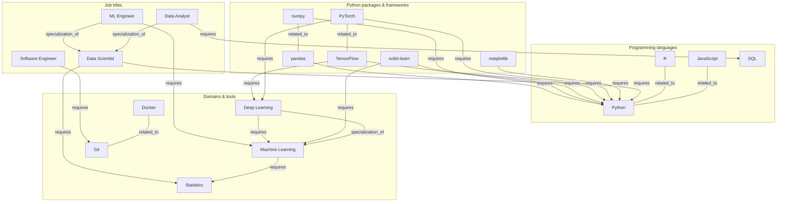

# Random Idea Collection

## Skill graph

Nodes:
Different skills

Edges: Relations between skills

- requires (prerequisite)
- related_to (lateral similarity)
- specialization_of (hierarchical)

### Visualization

### Skill proximity

Edges can have weights. These can help to deal with uncomplete Data. E.g. you have mentioned the skill "Machine Learning". This requires "stats", thus based on the weight you also have partially the skill "stats".

#### Rules for distribution in the graph

Each node has a skill level 0 to 1

Up: all higher level skill plus domain  
Down: To reach 1 you need to know the skill and score 1 in every spezilisation, i.e. b + sum kids

## AI Replaceabity

### Level of skill

I belive we have to model the level of a skill to some extend to capture relaistic dynamics. A basic Software engineer might be easilly replaceable while a well skilled one is not.

This can be captured by

- A: Different skills (easier)
- B: Level of proficancy of one skill (harder to model)

